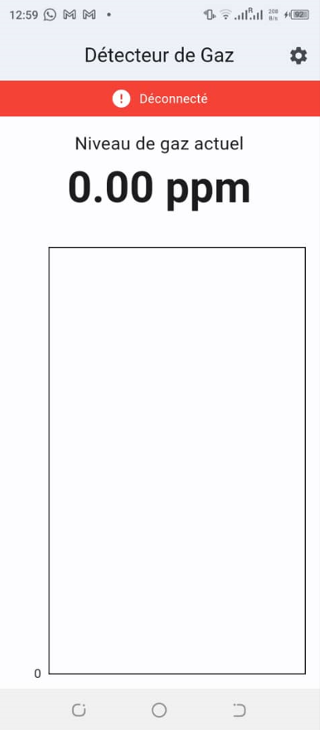
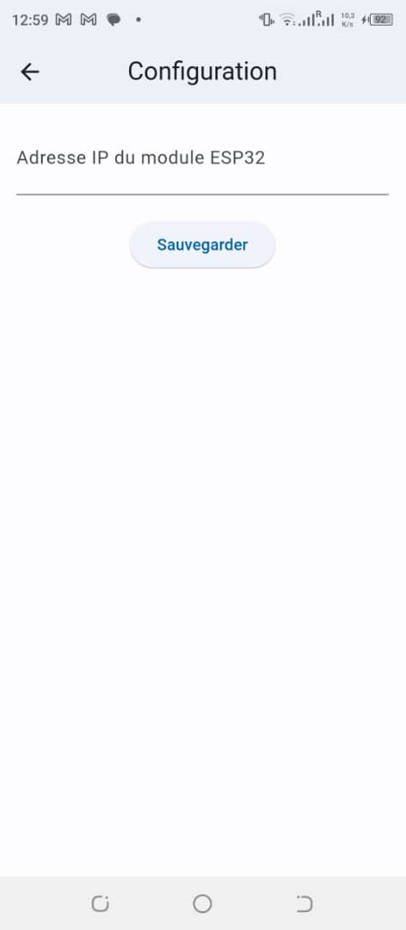

# Application de Détection de Gaz

Cette application mobile Flutter communique avec un module ESP32 via WiFi pour surveiller les niveaux de gaz en temps réel.

## Captures d'écran


*Interface principale montrant les lectures de gaz en temps réel*


*Interface de configuration pour la connexion à l'ESP32*

## Configuration requise

- Un smartphone Android ou iOS avec Flutter installé
- Un module ESP32 avec un capteur de gaz (MQ-2 ou similaire)
- Un réseau WiFi local

## Installation et Configuration

### Prérequis

- Flutter SDK (version 3.0.0 ou supérieure)
- Android Studio ou VS Code
- Git
- Un smartphone Android ou iOS
- Un module ESP32 avec un capteur de gaz (MQ-2 ou similaire)
- Un réseau WiFi local

### Récupération du code

1. Clonez le dépôt :
   ```bash
   git clone https://github.com/tanguy-kabore/gas-detector.git
   ```

2. Accédez au répertoire du projet :
   ```bash
   cd gas_detector
   ```

3. Installez les dépendances :
   ```bash
   flutter pub get
   ```

### Lancement de l'application

1. Connectez votre smartphone en mode développeur

2. Lancez l'application :
   ```bash
   flutter run
   ```

## Configuration du module ESP32

1. Téléversez le code suivant sur votre ESP32 :
   ```cpp
   #include <WiFi.h>
   #include <WebServer.h>
   #include <ArduinoJson.h>

   const char* ssid = "VOTRE_SSID";
   const char* password = "VOTRE_MOT_DE_PASSE";

   WebServer server(80);
   const int gasSensorPin = 34;  // Pin analogique pour le capteur de gaz

   void setup() {
     Serial.begin(115200);
     WiFi.begin(ssid, password);
     
     while (WiFi.status() != WL_CONNECTED) {
       delay(1000);
       Serial.println("Connexion au WiFi...");
     }
     
     Serial.println("Connecté au WiFi");
     Serial.println("Adresse IP: " + WiFi.localIP().toString());
     
     server.on("/gas", HTTP_GET, handleGasReading);
     server.begin();
   }

   void loop() {
     server.handleClient();
   }

   void handleGasReading() {
     int gasValue = analogRead(gasSensorPin);
     
     StaticJsonDocument<200> doc;
     doc["value"] = gasValue;
     doc["timestamp"] = millis();
     
     String response;
     serializeJson(doc, response);
     
     server.send(200, "application/json", response);
   }
   ```

2. Modifiez les variables `ssid` et `password` avec vos informations WiFi
3. Téléversez le code sur votre ESP32
4. Notez l'adresse IP affichée dans le moniteur série

## Configuration de l'application mobile

1. Installez l'application sur votre smartphone
2. Au premier lancement, entrez l'adresse IP de votre ESP32
3. L'application se connectera automatiquement au module ESP32

## Utilisation de l'application

1. L'écran principal affiche :
   - Le niveau de gaz actuel
   - Un graphique historique des mesures
   - Un indicateur de statut de connexion

2. Fonctionnalités :
   - Actualisation automatique toutes les 5 secondes
   - Alertes en cas de dépassement des seuils
   - Historique des mesures
   - Configuration des seuils d'alerte

## Dépannage

1. Si l'application ne se connecte pas :
   - Vérifiez que votre smartphone est sur le même réseau WiFi que l'ESP32
   - Vérifiez l'adresse IP saisie
   - Redémarrez l'ESP32

2. Si les lectures sont incorrectes :
   - Vérifiez le branchement du capteur
   - Calibrez le capteur selon les instructions du fabricant